### Step 0

First, I validated everything works locally

#### Build & run image

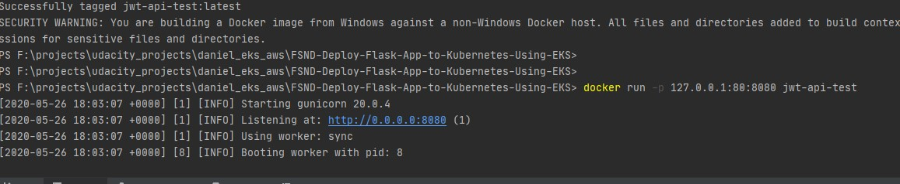


#### Test python code

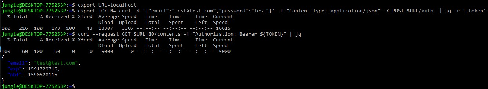


### Step 1

I simply logged in into my account, and made sure that the region was the desired one.

Details of each step can be consulted in [the guide](../troubleshooting/deploy.md)

### Step 2
`$ eksctl create cluster --name simple-jwt-api`
```shell script
[ℹ]  eksctl version 0.17.0
[ℹ]  using region us-east-2
[ℹ]  setting availability zones to [us-east-2a us-east-2c us-east-2b]
[ℹ]  subnets for us-east-2a - public:192.168.0.0/19 private:192.168.96.0/19
[ℹ]  subnets for us-east-2c - public:192.168.32.0/19 private:192.168.128.0/19
[ℹ]  subnets for us-east-2b - public:192.168.64.0/19 private:192.168.160.0/19
[ℹ]  nodegroup "ng-1b063727" will use "ami-0c1bd9eca9c869a0d" [AmazonLinux2/1.15]
[ℹ]  using Kubernetes version 1.15
[ℹ]  creating EKS cluster "simple-jwt-api" in "us-east-2" region with un-managed nodes
[ℹ]  will create 2 separate CloudFormation stacks for cluster itself and the initial nodegroup
[ℹ]  if you encounter any issues, check CloudFormation console or try 'eksctl utils describe-stacks --region=us-east-2 --cluster=simple-jwt-api'
[ℹ]  CloudWatch logging will not be enabled for cluster "simple-jwt-api" in "us-east-2"
[ℹ]  you can enable it with 'eksctl utils update-cluster-logging --region=us-east-2 --cluster=simple-jwt-api'
[ℹ]  Kubernetes API endpoint access will use default of {publicAccess=true, privateAccess=false} for cluster "simple-jwt-api" in "us-east-2"
[ℹ]  2 sequential tasks: { create cluster control plane "simple-jwt-api", create nodegroup "ng-1b063727" }
[ℹ]  building cluster stack "eksctl-simple-jwt-api-cluster"
[ℹ]  deploying stack "eksctl-simple-jwt-api-cluster"
[ℹ]  building nodegroup stack "eksctl-simple-jwt-api-nodegroup-ng-1b063727"
[ℹ]  --nodes-min=2 was set automatically for nodegroup ng-1b063727
[ℹ]  --nodes-max=2 was set automatically for nodegroup ng-1b063727
[ℹ]  deploying stack "eksctl-simple-jwt-api-nodegroup-ng-1b063727"
[✔]  all EKS cluster resources for "simple-jwt-api" have been created
[✔]  saved kubeconfig as "C:\\Users\\danie/.kube/config"
[ℹ]  adding identity "arn:aws:iam::083739371673:role/eksctl-simple-jwt-api-nodegroup-n-NodeInstanceRole-1QBTPFPQV9R7T" to auth ConfigMap
[ℹ]  nodegroup "ng-1b063727" has 1 node(s)
[ℹ]  node "ip-192-168-45-0.us-east-2.compute.internal" is not ready
[ℹ]  waiting for at least 2 node(s) to become ready in "ng-1b063727"
[ℹ]  nodegroup "ng-1b063727" has 2 node(s)
[ℹ]  node "ip-192-168-18-169.us-east-2.compute.internal" is ready
[ℹ]  node "ip-192-168-45-0.us-east-2.compute.internal" is ready
[ℹ]  kubectl command should work with "C:\\Users\\danie/.kube/config", try 'kubectl get nodes'
[✔]  EKS cluster "simple-jwt-api" in "us-east-2" region is ready
```

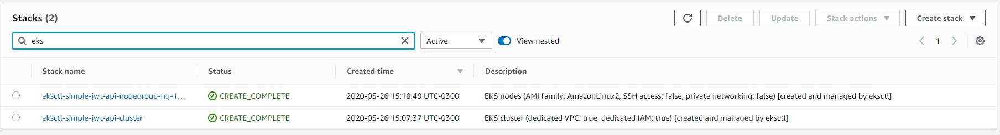

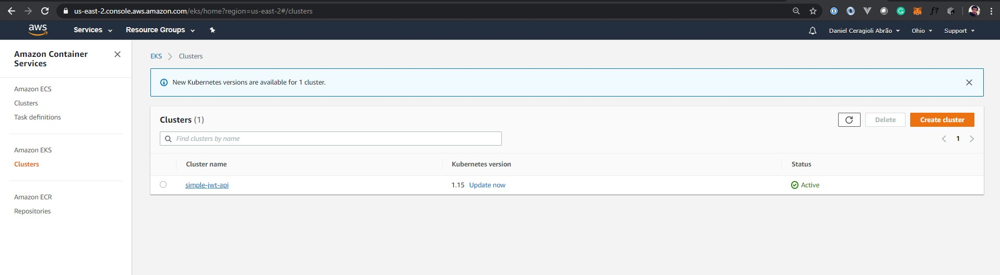


### Step 3
`$ aws ssm put-parameter --name JWT_SECRET --value "YourJWTSecret" --type  SecureString --overwrite `
```shell script
{
    "Version": 4,
    "Tier": "Standard"
}
```

### Step 4

```shell script
danie@DESKTOP-7752S3P MINGW64 /f/projects/udacity_projects/daniel_eks_aws/FSND-Deploy-Flask-App-to-Kubernetes-Using-EKS (student_support)
$ ACCOUNT_ID=$(aws sts get-caller-identity --query Account --output text)

danie@DESKTOP-7752S3P MINGW64 /f/projects/udacity_projects/daniel_eks_aws/FSND-Deploy-Flask-App-to-Kubernetes-Using-EKS (student_support)
$ TRUST="{ \"Version\": \"2012-10-17\", \"Statement\": [ { \"Effect\": \"Allow\",  \"Principal\": { \"AWS\": \"arn:aws:iam::${ACCOUNT_ID}:root\" }, \"Action\":  \"sts:AssumeRole\" } ] }"

danie@DESKTOP-7752S3P MINGW64 /f/projects/udacity_projects/daniel_eks_aws/FSND-Deploy-Flask-App-to-Kubernetes-Using-EKS (student_support)
$ aws iam create-role --role-name UdacityFlaskDeployCBKubectlRole --assume-role-policy-document "$TRUST" --output text --query 'Role.Arn'

An error occurred (EntityAlreadyExists) when calling the CreateRole operation: Role with name UdacityFlaskDeployCBKubectlRole already exists.

danie@DESKTOP-7752S3P MINGW64 /f/projects/udacity_projects/daniel_eks_aws/FSND-Deploy-Flask-App-to-Kubernetes-Using-EKS (student_support)
$ echo '{ "Version": "2012-10-17", "Statement": [ { "Effect": "Allow", "Action": [ "eks:Describe*", "ssm:GetParameters" ], "Resource": "*" } ] }' > ./iam-role-policy

danie@DESKTOP-7752S3P MINGW64 /f/projects/udacity_projects/daniel_eks_aws/FSND-Deploy-Flask-App-to-Kubernetes-Using-EKS (student_support)
$ aws iam put-role-policy --role-name UdacityFlaskDeployCBKubectlRole --policy-name eks-describe --policy-document file://./iam-role-policy

danie@DESKTOP-7752S3P MINGW64 /f/projects/udacity_projects/daniel_eks_aws/FSND-Deploy-Flask-App-to-Kubernetes-Using-EKS (student_support)
$ kubectl get -n kube-system configmap/aws-auth -o yaml > ./aws-auth-patch.yml

```

### Step 5

#### Unmodified aws-auth-patch
`cat ./aws-auth-patch.yml`
```yaml
apiVersion: v1
data:
  mapRoles: |
    - groups:
      - system:bootstrappers
      - system:nodes
      rolearn: arn:aws:iam::083739371673:role/eksctl-simple-jwt-api-nodegroup-n-NodeInstanceRole-1QBTPFPQV9R7T
      username: system:node:{{EC2PrivateDNSName}}
  mapUsers: |
    []
kind: ConfigMap
metadata:
  creationTimestamp: "2020-05-26T18:22:48Z"
  name: aws-auth
  namespace: kube-system
  resourceVersion: "830"
  selfLink: /api/v1/namespaces/kube-system/configmaps/aws-auth
  uid: 35b6c281-329c-4cbd-a3ed-adc0b327eb98
```

#### Modified file

```yaml
apiVersion: v1
data:
  mapRoles: |
    - groups:
      - system:bootstrappers
      - system:nodes
      rolearn: arn:aws:iam::083739371673:role/eksctl-simple-jwt-api-nodegroup-n-NodeInstanceRole-1QBTPFPQV9R7T
      username: system:node:{{EC2PrivateDNSName}}
    - groups:
      - system:masters
      rolearn: arn:aws:iam::083739371673:role/UdacityFlaskDeployCBKubectlRole
  mapUsers: |
    []
kind: ConfigMap
metadata:
  creationTimestamp: "2020-05-26T18:22:48Z"
  name: aws-auth
  namespace: kube-system
  resourceVersion: "830"
  selfLink: /api/v1/namespaces/kube-system/configmaps/aws-auth
  uid: 35b6c281-329c-4cbd-a3ed-adc0b327eb98
```

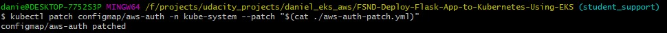


### Step 6, 7 and 8


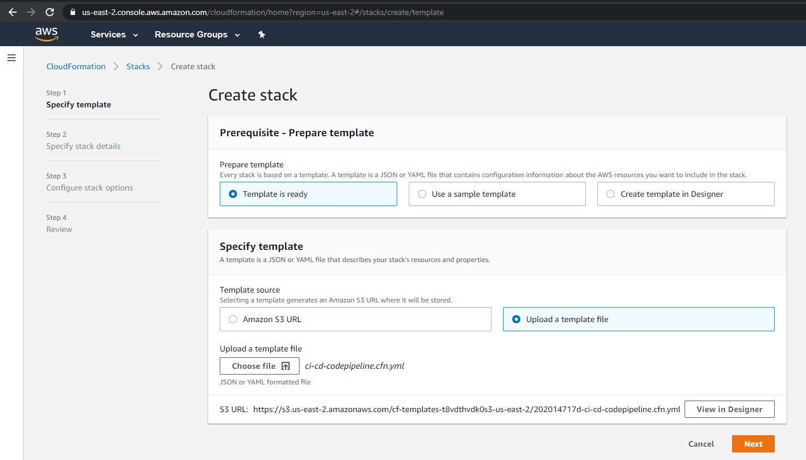

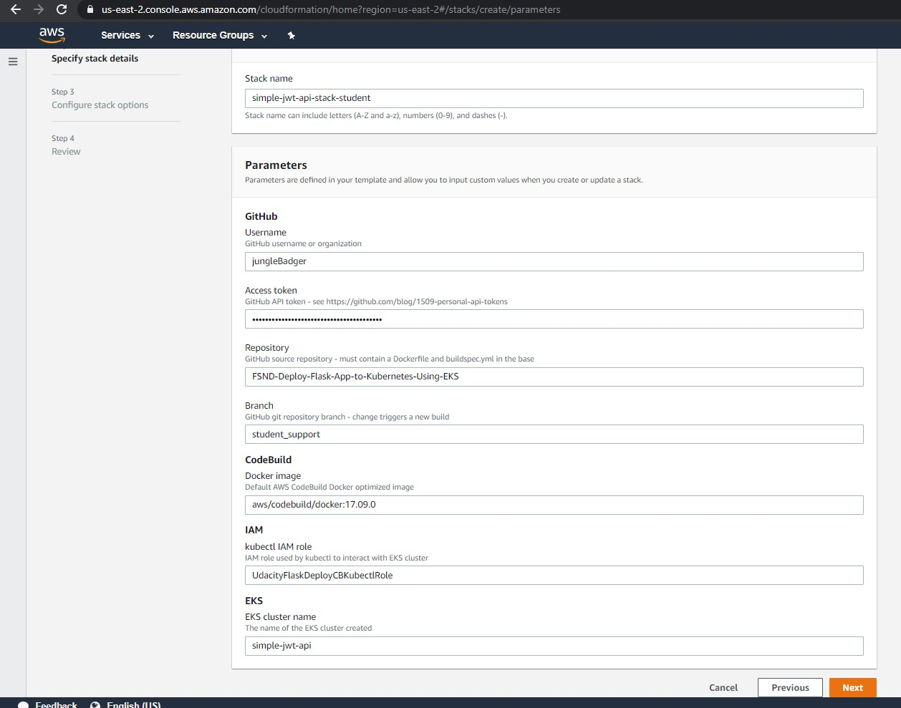

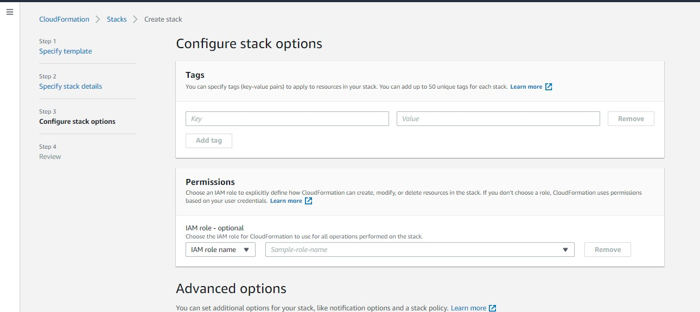


### Step 9

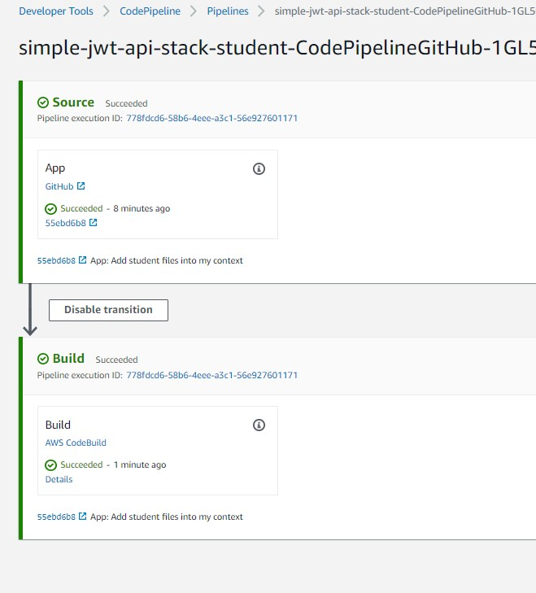


### Step 10

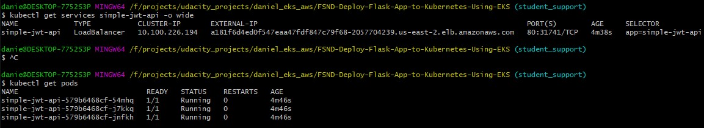


### Step 11


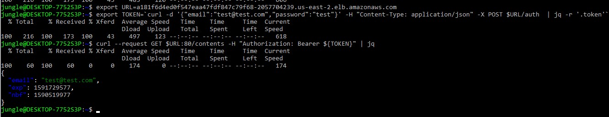
